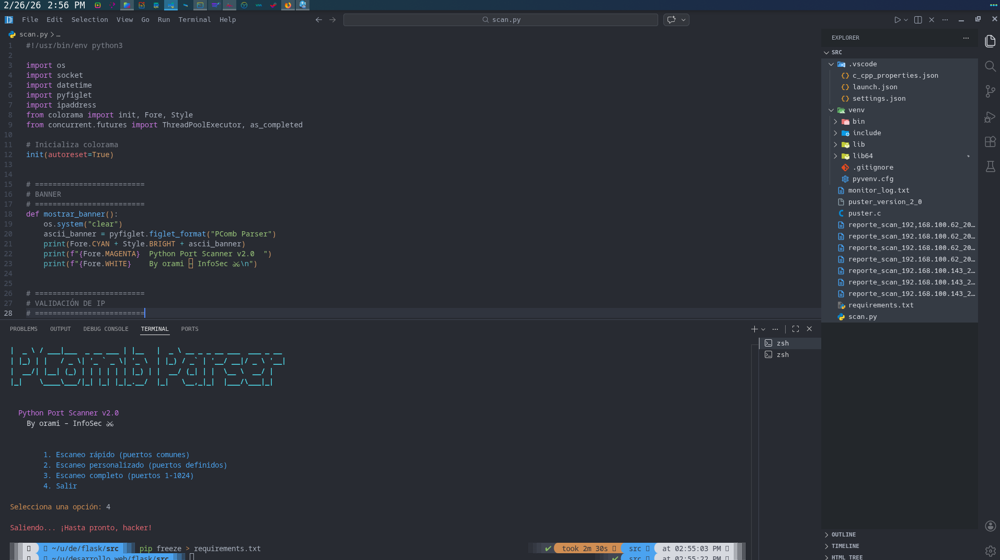
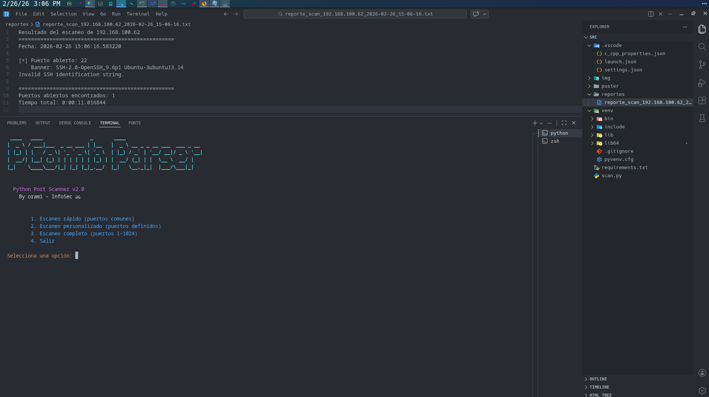

# PComb Parser

PComb Parser es una herramienta de consola para practicar escaneo básico de puertos y lectura de reportes guardados.

## Screenshots




## Funciones

- Escaneo de puertos TCP por rangos simples.
- Generación de reportes `.txt`.
- Lectura de reportes previamente guardados.

## Requisitos

- Python 3.11 o superior

## Instalación

```bash
python3 -m venv .venv
source .venv/bin/activate
pip install -r requirements.txt
```

## Ejecución

```bash
python scan.py
```

## Estructura

- `scan.py`: archivo principal del proyecto.
- `requirements.txt`: dependencias usadas por el programa.
- `reportes/`: carpeta donde se guardan los reportes del escaneo.
- `img/`: capturas opcionales.

## Nota

Este proyecto fue ajustado para mantener una lógica simple y fácil de seguir para un estudiante principiante.
